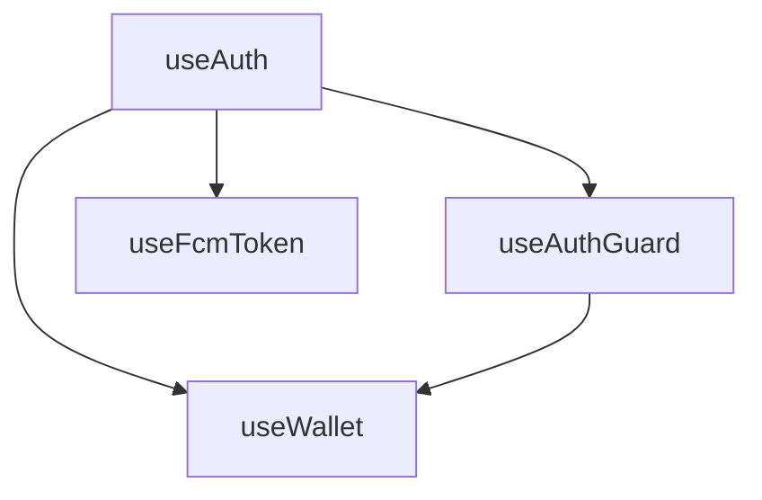

# Custom Hooks Documentation

## Overview
Custom React hooks for SquarePicks application providing authentication, wallet management, and push notifications functionality.

## Available Hooks

### Authentication
- **[useAuth](./useAuth.md)** - Basic Firebase authentication state management
- **[useAuthGuard](./useAuthGuard.md)** - Protected route authentication with email verification

### Wallet & User Data
- **[useWallet](./useWallet.md)** - Wallet balance and management with real-time updates

### Notifications
- **[useFcmToken](./useFcmToken.md)** - Firebase Cloud Messaging token registration and management

## Quick Reference

| Hook | Purpose | Key Features | Auth Required |
|------|---------|--------------|---------------|
| `useAuth` | Auth state tracking | Real-time updates, loading state | No |
| `useAuthGuard` | Route protection | Auto-redirect, email verification | Yes |
| `useWallet` | Wallet operations | Real-time balance, initialization | Yes |
| `useFcmToken` | Push notifications | Token management, Firestore storage | Yes |

## Common Usage Patterns

### Protected Page with Wallet
```typescript
import { useAuthGuard } from '@/hooks/useAuthGuard';
import { useWallet } from '@/hooks/useWallet';

function WalletPage() {
  const { user, loading: authLoading } = useAuthGuard();
  const { balance, hasWallet, isLoading: walletLoading } = useWallet();

  if (authLoading || walletLoading) return <Spinner />;
  
  return (
    <div>
      <h1>Welcome, {user?.email}</h1>
      <p>Balance: ${balance.toFixed(2)}</p>
    </div>
  );
}
```

### Notification-Enabled Component
```typescript
import { useAuth } from '@/hooks/useAuth';
import { useFcmToken } from '@/hooks/useFcmToken';

function NotificationSettings() {
  const { user } = useAuth();
  const { permission, token } = useFcmToken();

  if (!user) return null;

  return (
    <div>
      <p>Notifications: {permission}</p>
      {token && <p>✓ Enabled</p>}
    </div>
  );
}
```

## Hook Dependencies



- `useAuthGuard` depends on `useAuth` patterns
- `useWallet` requires authentication
- `useFcmToken` requires authentication

## Best Practices

1. **Loading States**: Always handle loading states before rendering content
2. **Error Handling**: Display error messages to users
3. **Cleanup**: Hooks handle cleanup automatically
4. **Single Responsibility**: Each hook has a specific purpose
5. **Composition**: Combine hooks for complex functionality

## Performance Tips

- Hooks use Firebase real-time listeners efficiently
- Automatic cleanup prevents memory leaks
- Minimal re-renders through optimized state updates
- Shared Firebase instances avoid duplicate subscriptions

## Testing Considerations

- Mock Firebase auth and Firestore
- Test loading states
- Test error scenarios
- Test cleanup on unmount

## Related Documentation

- [Utilities](../utils/README.md)
- [Integrations](../integrations/README.md)
- [Security](../security/README.md)

