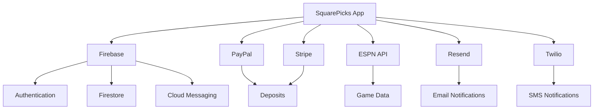

# External Integrations

## Overview
Third-party service integrations powering the SquarePicks application.

## Integrated Services

### Sports Data
- **[ESPN API](./espn-api.md)** - NFL game schedules, scores, and live updates

### Payment Processing
- **[PayPal](./paypal.md)** - Deposit processing and payment capture
- **[Stripe](./stripe.md)** - Alternative payment processing (in development)

### Backend Services
- **[Firebase](./firebase.md)** - Authentication, database, cloud messaging, analytics
- **[Google Auth](./google-auth.md)** - OAuth 2.0 sign-in via Firebase

### Communications
- **[Resend](./resend.md)** - Transactional email delivery
- **[Twilio](./twilio.md)** - SMS notifications and phone verification

## Quick Reference

| Service | Status | Purpose | Auth Type |
|---------|--------|---------|-----------|
| ESPN API | ✅ Active | Game data | None (public) |
| PayPal | ✅ Active | Deposits | OAuth 2.0 |
| Stripe | 🚧 Planned | Deposits | API Key |
| Firebase | ✅ Active | Auth, DB, FCM | Service Account |
| Google Auth | ✅ Active | User sign-in | OAuth 2.0 |
| Resend | 📦 Installed | Emails | API Key |
| Twilio | 📦 Installed | SMS | API Key |

**Legend**:
- ✅ Active: Fully implemented and in use
- 🚧 Planned: Placeholder/mock implementation
- 📦 Installed: Dependencies added but not implemented

## Environment Variables Summary

```bash
# ESPN (none required - public API)

# PayPal
PAYPAL_CLIENT_ID=
PAYPAL_CLIENT_SECRET=
PAYPAL_ENV=sandbox|live

# Stripe
STRIPE_SECRET_KEY=
NEXT_PUBLIC_STRIPE_PUBLISHABLE_KEY=

# Firebase
NEXT_PUBLIC_FIREBASE_API_KEY=
NEXT_PUBLIC_FIREBASE_AUTH_DOMAIN=
NEXT_PUBLIC_FIREBASE_PROJECT_ID=
NEXT_PUBLIC_FIREBASE_STORAGE_BUCKET=
NEXT_PUBLIC_FIREBASE_MESSAGING_SENDER_ID=
NEXT_PUBLIC_FIREBASE_APP_ID=
NEXT_PUBLIC_FIREBASE_VAPID_KEY=
NEXT_PUBLIC_RECAPTCHA_V3_SITE_KEY=
FIREBASE_SERVICE_ACCOUNT_KEY=

# Resend
RESEND_API_KEY=
RESEND_FROM_EMAIL=

# Twilio
TWILIO_ACCOUNT_SID=
TWILIO_AUTH_TOKEN=
TWILIO_PHONE_NUMBER=
TWILIO_VERIFY_SERVICE_SID=
```

## Integration Architecture



## Data Flow

### Deposit Flow
1. User initiates deposit (PayPal/Stripe)
2. Payment processed through provider
3. Webhook/callback confirms payment
4. API route updates wallet balance (Firestore)
5. Confirmation email sent (Resend)
6. Optional SMS confirmation (Twilio)

### Game Update Flow
1. ESPN API polled for score updates
2. Cloud Function processes data
3. Firestore updated with new scores
4. FCM notification sent to users
5. Optional email/SMS for wins

### Authentication Flow
1. User signs in (Email/Google)
2. Firebase Auth validates credentials
3. User document created/updated in Firestore
4. FCM token registered for notifications
5. Welcome email sent (Resend)

## Rate Limits Summary

| Service | Limit | Notes |
|---------|-------|-------|
| ESPN API | ~1 req/sec | No official limit, conservative approach |
| PayPal | 20 req/sec | Sandbox and production |
| Stripe | 100 req/sec | Per rolling window |
| Firebase Auth | 100 signup/hr | Per IP address |
| Firestore | 10K writes/sec | Per database |
| FCM | 1.5M msg/min | Upstream messages |
| Resend | 100/day | Free tier |
| Twilio | 10 SMS/sec | Default throughput |

## Error Handling Patterns

### Retry with Exponential Backoff
```typescript
async function retryWithBackoff<T>(
  fn: () => Promise<T>,
  maxRetries: number = 3,
  initialDelay: number = 1000
): Promise<T> {
  let lastError: Error;
  
  for (let i = 0; i < maxRetries; i++) {
    try {
      return await fn();
    } catch (error) {
      lastError = error as Error;
      if (i < maxRetries - 1) {
        await delay(initialDelay * Math.pow(2, i));
      }
    }
  }
  
  throw lastError!;
}
```

### Circuit Breaker
```typescript
class CircuitBreaker {
  private failures = 0;
  private lastFailTime = 0;
  private readonly threshold = 5;
  private readonly timeout = 60000; // 1 minute

  async execute<T>(fn: () => Promise<T>): Promise<T> {
    if (this.isOpen()) {
      throw new Error('Circuit breaker is open');
    }

    try {
      const result = await fn();
      this.onSuccess();
      return result;
    } catch (error) {
      this.onFailure();
      throw error;
    }
  }

  private isOpen(): boolean {
    if (this.failures >= this.threshold) {
      if (Date.now() - this.lastFailTime > this.timeout) {
        this.reset();
        return false;
      }
      return true;
    }
    return false;
  }

  private onSuccess(): void {
    this.failures = 0;
  }

  private onFailure(): void {
    this.failures++;
    this.lastFailTime = Date.now();
  }

  private reset(): void {
    this.failures = 0;
  }
}
```

## Security Best Practices

1. **API Keys**: Store all secrets in environment variables
2. **Server-Side**: Process payments and sensitive operations on server
3. **Validation**: Validate all data before sending to external APIs
4. **Webhooks**: Verify webhook signatures
5. **Rate Limiting**: Implement application-level rate limits
6. **Logging**: Log all external API calls for auditing
7. **Error Messages**: Don't expose internal errors to users
8. **Testing**: Use test/sandbox environments for development

## Monitoring & Logging

### What to Monitor
- API response times
- Error rates
- Rate limit usage
- Webhook delivery success
- Payment success rates
- Email/SMS delivery rates

### Logging Template
```typescript
console.log('[integration:name]', {
  operation: 'operation_name',
  status: 'success|error',
  userId: 'user_id',
  duration: 123, // ms
  timestamp: new Date().toISOString(),
  error: error?.message,
});
```

## Testing Strategy

### Unit Tests
- Mock external API calls
- Test error handling
- Verify data transformations

### Integration Tests
- Use sandbox/test environments
- Test full payment flows
- Verify webhook handling

### End-to-End Tests
- Test complete user journeys
- Verify email/SMS delivery
- Test notification flows

## Cost Optimization

### Tips
1. **Cache API responses** when appropriate
2. **Batch operations** where possible
3. **Use free tiers** for development
4. **Monitor usage** to avoid surprises
5. **Set spending alerts** on all services
6. **Optimize queries** to reduce Firestore reads
7. **Use webhooks** instead of polling where available

## Related Documentation

- [Hooks](../hooks/README.md)
- [Utilities](../utils/README.md)
- [Security](../security/README.md)
- [Configuration](../config/README.md)

## Support & Resources

### Getting Help
- Check individual integration docs for specific issues
- Review error logs in respective dashboards
- Test in sandbox environments first
- Contact support for persistent issues

### Useful Links
- [Firebase Console](https://console.firebase.google.com)
- [PayPal Developer](https://developer.paypal.com)
- [Stripe Dashboard](https://dashboard.stripe.com)
- [Resend Dashboard](https://resend.com/dashboard)
- [Twilio Console](https://console.twilio.com)

